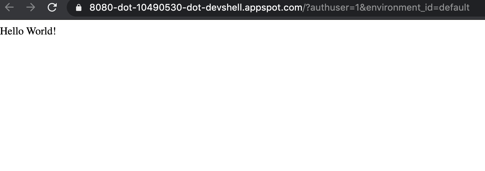
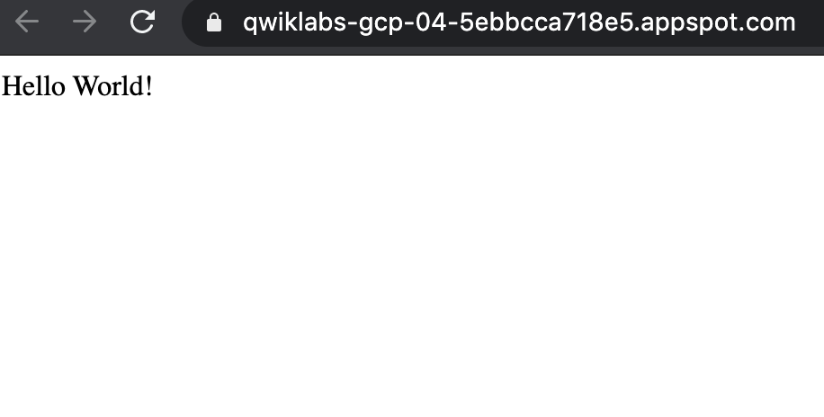

# Getting Started with App Engine

Getting through the hands-on qwiklab just using the cli. We will be using the [cloud shell](https://cloud.google.com/shell) provided by Google Cloud Console.

## Initialize App Engine

1. Initialize your App Engine app with your project and choose its region

    ```shell
    gcloud app create --project=$DEVSHELL_PROJECT_ID
    ```

    When prompted, select the [region](https://cloud.google.com/appengine/docs/locations) where you want your App Engine application to be located

    Alternatively you can explicitly set the region & initialize your App Engine with the command below where `REGION` is the region you set

    ```shell
    gcloud app create --project=$DEVSHELL_PROJECT_ID --region=REGION
    ```

2. Clone the source code repository for a sample application in the **hello_world** directory

    ```shell
    git clone https://github.com/GoogleCloudPlatform/python-docs-samples
    ```

3. Navigate to the source directory

    ```shell
    cd python-docs-samples/appengine/standard_python3/hello_world
    ```

## Run Hello World application locally

1. Execute the following command to download and update the packages list

    ```shell
    sudo apt-get update
    ```

2. Set up a virtual environment in which you will run your application. Python virtual environments are used to isolate package installations from the system

    ```shell
    sudo apt-get install virtualenv
    ```

    If prompted `[Y/n]` press `Y` and then `Enter`

    ```shell
    virtualenv -p python3 venv
    ```

3. Activate the virtual environment

    ```shell
    source venv/bin/activate
    ```

4. Navigate to your project directory & install the dependencies

    ```shell
    pip install  -r requirements.txt
    ```

5. Run the application

    ```shell
    python main.py
    ```

    If there is any warning, you can ignore

6. In Cloud Shell in the Google Console Dashboard, click **Web preview** > **Preview on port 8080** to preview the application

    Result:

     

7. To end the test, return to Cloud Shell and press **Ctrl+C** to abort the deployed service

## Deploy and run Hello World on App Engine

1. Navigate to the source directory

    ```shell
    cd ~/python-docs-samples/appengine/standard_python3/hello_world
    ```

2. Deploy your Hello World app

    ```shell
    gcloud app deploy
    ```

    If prompted "Do you want to continue `(Y/n)?`", press `Y` and then `Enter`

    This app deploy command uses the `app.yaml` file to identify project configuration.

3. Launch your browser to view the app at `http://YOUR_PROJECT_ID.appspot.com` by the following command

    ```shell
    gcloud app browse
    ```

    Copy and paste the URL into a new browser window.

    Result:

    

    Congratulations! You created your first application using App Engine! 😀
